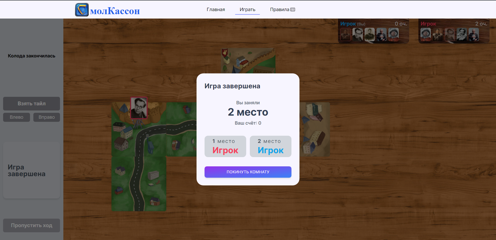

# SmolCassonne - Carcassonne about Smolensk
Online board game in Smolensk style with multiplayer.
You will compete with other players for a greater number of points
by putting Smolensk tiles on the board and putting Smolyan on them.

**It's simple! Isn't it?**

# How to launch a project local?
1. Clone repository to your PC:
   `git clone https://github.com/Color-Kat/SmolCassonne.git ./your-directory`
2. `cd ./client`
3. `npm i` - install dependencies for client
4. `npm run dev` - run vite in dev mode
5. `cd ../server`
6. `npm i` - install dependencies for server
7. `npm run start` - run server

# Screenshots

Start game screen

Start of the game

Select Smolyanin to place it on the map

The end of the game

List of custom tiles with Smolensk
https://disk.yandex.ru/d/Tnz6bEX8egtDgQ